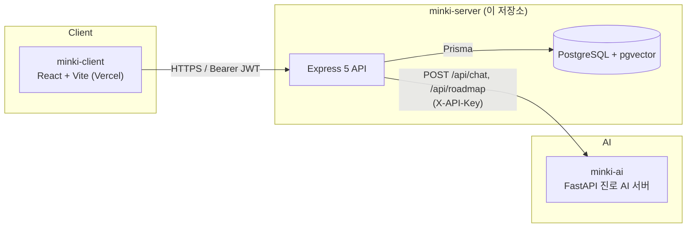

# 민기 (Minki)

> 모든 답변에 출처가 있습니다.

국가직무능력표준(NCS)과 공공 데이터를 기반으로, 근거 있는 진로·전공 정보를 제공하는 학생 대상 커리어 플랫폼입니다. 직무 정보를 가짜로 지어내지 않고, 모든 AI 답변과 로드맵 항목에 출처를 남기는 것을 원칙으로 합니다.

이 저장소(`minki-server`)는 민기의 **백엔드 API 서버**입니다. 프론트엔드는 [`minki-client`](https://github.com/Mingi-s-Big-Mac/minki-client), 진로 AI 서버는 [`minki-ai`](https://github.com/Mingi-s-Big-Mac/minki-ai) 저장소에 있습니다.

## 데모

|                    |                                      |
| ------------------ | ------------------------------------ |
| 웹 서비스          | https://minki-navy.vercel.app        |
| API 서버           | https://minki-api.duckdns.org/api/v1 |
| API 문서 (Swagger) | https://minki-api.duckdns.org/docs   |

## 핵심 기능

- **진로 검색** — 직무·기술·자격증·학과 기준으로 검증된 직무 정보를 검색하고, 직무 2~4개를 나란히 비교합니다.
- **AI 질의응답** — 진로 관련 질문에 실제 직업 정보에 근거한 답변을 출처와 함께 받습니다.
- **로드맵 생성** — 학년·전공·목표 직무를 입력하면 학기별 학습 과제·습득 기술·취득 자격증으로 구성된 로드맵을 생성합니다.
- **관심 직업 저장 / 대시보드** — 관심 직업을 저장해두고, 홈 대시보드에서 최근 활동과 함께 모아봅니다.

## 아키텍처



- 인증은 이메일/비밀번호 로그인 후 발급되는 단일 JWT(만료 시 재로그인, refresh 없음)를 `Authorization: Bearer` 헤더로 사용합니다.
- 백엔드는 AI 서버가 돌려준 채팅 답변/로드맵 결과를 그대로 신뢰하지 않고, 인용된 출처마다 `Source` 레코드를 만들어 연결합니다 — 그래서 프론트에서 항상 "어디서 나온 정보인지" 추적할 수 있습니다.
- AI 서버가 아직 준비되지 않았거나 응답에 실패하면 가짜 콘텐츠를 만들지 않고 명확한 에러(`AI_SERVICE_NOT_CONFIGURED`, `AI_RESPONSE_FAILED` 등)를 반환합니다.

## 기술 스택

| 영역               | 스택                                                                                   |
| ------------------ | -------------------------------------------------------------------------------------- |
| 프론트엔드         | React, TypeScript, Vite, Tailwind CSS, Vercel                                          |
| 백엔드 (이 저장소) | Node.js 24, Express 5, Prisma, Zod, Pino, JavaScript ESM                               |
| 데이터베이스       | PostgreSQL, pgvector (RAG 임베딩 대비)                                                 |
| AI 서버            | FastAPI, 진로 AI 채팅/로드맵 생성 (NCS·워크넷 기반)                                    |
| 인프라             | AWS EC2, Docker Compose, GitHub Actions CI/CD (자동 배포 + 헬스체크 실패 시 자동 롤백) |

## 팀

<!-- TODO: 팀원 이름 / 역할 채워주세요 -->

| 이름 | 역할       |
| ---- | ---------- |
|      | 백엔드     |
|      | 프론트엔드 |
|      | AI         |
|      | 인프라     |

## 왜 "출처"를 강조하나요

진로 정보는 잘못되면 학생의 실제 선택에 영향을 줍니다. 그래서 이 프로젝트는 다음을 원칙으로 합니다:

- 실제 공식 데이터(NCS, 워크넷, 커리어넷 등) 없이 가짜 직업/자격증/통계를 만들지 않습니다.
- AI가 인용한 모든 문장은 `Source` 테이블의 레코드로 연결되어, 응답에 항상 출처가 함께 내려갑니다.
- 테스트/데모용 더미 데이터는 `(DEMO)` 표시를 붙이고 실제 공식 정보와 구분합니다 ([Data import](docs/data-import.md) 참고).

---

# 개발 문서 (minki-server)

Express backend for a source-based major and career exploration service.

## Stack

- Node.js 24 LTS, npm 11
- JavaScript ESM
- Express 5
- PostgreSQL, Prisma, pgvector-ready Docker image
- Zod, Pino, Helmet, CORS, express-rate-limit
- Vitest, Supertest, ESLint, Prettier

## Local Setup

```bash
cp .env.example .env
npm ci
npm run prisma:generate
npm run prisma:migrate:dev
npm run dev
```

Health:

- `GET http://localhost:3000/api/v1/health`
- `GET http://localhost:3000/api/v1/health/db`
- Swagger UI: `http://localhost:3000/docs`
- OpenAPI JSON: `http://localhost:3000/openapi.json`

Production-style local start:

```bash
npm start
```

## Occupation Data

`GET /occupations`, `/interests`, roadmaps, and AI Q&A all read from the
`Occupation`/`Skill`/`Qualification`/`Major`/`Source` tables, which start
empty. Load data with:

```bash
npm run seed:occupations -- data/occupations.dummy.json      # marked (DEMO), safe for testing
npm run seed:occupations -- data/occupations.template.json   # fill with real data first
```

Copy `data/occupations.template.json`, fill it with real occupation data from
an authoritative source (NCS, 워크넷, 커리어넷, etc.), then run the command
above against your file. See [Data import](docs/data-import.md) for the file
format. This does not run automatically — it must be invoked manually.

## Docker

```bash
docker compose up --build -d
docker compose ps
curl http://localhost:3000/api/v1/health
curl http://localhost:3000/api/v1/health/db
docker compose down
```

If Docker Compose v2 is unavailable, use `docker-compose` for the same commands.

PostgreSQL uses a named volume and is not published to the host by default.

## Deployment

### GitHub Secrets

Configure these repository secrets:

| Secret        | Value                                                               |
| ------------- | ------------------------------------------------------------------- |
| `EC2_HOST`    | EC2 public hostname or IP address                                   |
| `EC2_USER`    | Ubuntu SSH user                                                     |
| `EC2_SSH_KEY` | Private key whose public key is in the EC2 user's `authorized_keys` |
| `DEPLOY_PATH` | Absolute path to the repository on EC2                              |

### First-time server setup

The EC2 user must have `git`, `curl`, Docker Engine, and Docker Compose v2 installed, permission to run Docker, SSH access from GitHub Actions, and read access to this repository.

```bash
git clone <repository-url> <deploy-path>
cd <deploy-path>
git switch main
cp .env.example .env
$EDITOR .env
docker compose up -d --build
curl --fail https://minki-api.duckdns.org/api/v1/health
```

Set `DEPLOY_PATH` to the same absolute `<deploy-path>`. Keep the production `.env` only on EC2 and never commit it. For a private repository, configure an EC2 deploy key or another read-only Git credential so `git fetch origin main` works non-interactively.

### Manual deployment

Run from `DEPLOY_PATH` on EC2:

```bash
git fetch origin main
git reset --hard origin/main
docker compose build
docker compose up -d
curl --fail https://minki-api.duckdns.org/api/v1/health
```

This does not remove the named PostgreSQL volume or overwrite the ignored production `.env`.

### CI/CD

Pull requests and pushes to `main` run `npm ci`, Prisma validation/client generation, linting, formatting checks, tests, Compose validation, and a Docker image build. Tests use injected repositories and providers, so CI does not start an unnecessary PostgreSQL service container.

After CI succeeds for a `main` push, the deploy job connects to EC2 over SSH, saves the current commit, resets the server checkout to `origin/main`, builds and starts the Compose services, then retries the public health endpoint. If health checks keep failing, it prints `docker compose ps` and application logs, resets to the saved commit, rebuilds, and starts the previous version before failing the workflow. Prisma migrations run when the application container starts; rollback does not reverse database migrations, so production migrations must remain backward-compatible with the previous application version.

## Verification

```bash
npm ci
npm run lint
npm run format:check
npm test
npm run prisma:validate
npm run prisma:generate
docker compose config
docker build --tag minki-server:verify .
```

## Environment Variables

Required:

- `NODE_ENV`: `development`, `test`, or `production`
- `PORT`: application port
- `DATABASE_URL`: PostgreSQL connection string
- `CORS_ORIGIN`: comma-separated allowed origins
- `LOG_LEVEL`: Pino log level
- `ALLOWED_EMAIL_DOMAINS`: comma-separated school email domains

Required in production:

- `ACCESS_TOKEN_SECRET`

Optional:

- `ACCESS_TOKEN_EXPIRES_IN` (default `7d`; there is no refresh token, so this is the whole session lifetime)
- `AI_SERVICE_URL`, `AI_SERVICE_API_KEY`, `AI_SERVICE_TIMEOUT_MS` (default `90000`ms — the AI service can take up to ~35s to generate a roadmap)
- Docker-only: `APP_PORT`, `POSTGRES_USER`, `POSTGRES_PASSWORD`, `POSTGRES_DB`

The AI service variables are optional. If they are not configured, `/roadmaps` and `/conversations/:id/messages` still start, but return a clear `AI_SERVICE_NOT_CONFIGURED` error instead of generating fake official data.

`REFRESH_TOKEN_SECRET`, `REFRESH_TOKEN_EXPIRES_IN`, `EMAIL_VERIFICATION_EXPIRES_IN`, and `SMTP_*` are still accepted for backward compatibility but are no longer used — email verification and refresh token rotation were removed to fit the hackathon timeline (see `docs/requirements.md`).

## Structure

```text
src/
  app.js
  server.js
  config/
  common/
    ai/            # shared AI HTTP client + citation source resolution
  modules/
    auth/
    users/
    schools/
    catalog/
    occupations/
    interests/
    dashboard/
    roadmaps/
    conversations/
    health/
  routes/
```

Docs:

- [Architecture](docs/architecture.md)
- [Conventions](docs/conventions.md)
- [Definition of Done](docs/definition-of-done.md)
- [Requirements](docs/requirements.md)
- [Database](docs/database.md)
- [API](docs/api.md)
- [Data import](docs/data-import.md)
- [Open questions](docs/open-questions.md)

## License

[Apache License 2.0](LICENSE)
